# Gox: Zero-Boilerplate Distributed Pipeline System

[](https://golang.org/)
[](https://github.com/tenzoki/gox/releases)
[](https://joinup.ec.europa.eu/collection/eupl/eupl-text-eupl-12)
[](./test.sh)

Gox is a revolutionary distributed processing system that **eliminates 90% of agent boilerplate code** through its innovative Agent Framework. Build complex data pipelines with just business logic - the framework handles all infrastructure concerns automatically.

## ⚡ **Revolutionary Agent Framework**

**Before** (Traditional agent - 100+ lines of boilerplate):
```go
// 37 lines of BaseAgent setup
// 25 lines of connection management  
// 20 lines of signal handling
// 30+ lines of message processing loops
// Custom business logic scattered throughout
```

**After** (Framework agent - minimal code):
```go
type TextTransformer struct {
    agent.DefaultAgentRunner
}

// ONLY business logic needed
func (t *TextTransformer) ProcessMessage(msg *client.BrokerMessage, base *agent.BaseAgent) (*client.BrokerMessage, error) {
    text := strings.ToUpper(msg.Payload.(string))
    return &client.BrokerMessage{
        ID:      msg.ID + "_transformed",
        Payload: text + "\n--- PROCESSED BY GOX ---",
    }, nil
}

func main() {
    agent.Run(&TextTransformer{}, "text-transformer") // All boilerplate eliminated!
}
```

## 🚀 **Quick Start**

```bash
# Build and test everything
./build.sh && ./test.sh

# Start pipeline (auto-deploys agents with dependency ordering)
./build/gox

# Add test files - watch automatic processing
echo "Hello World!" > examples/pipeline-demo/input/test.txt
```

### 3. Basic Configuration

**Main Config (gox.yaml)**:
```yaml
app_name: "my-pipeline"
debug: true

support:
  port: ":9000"
  debug: true

broker:
  port: ":9001"
  protocol: "tcp"
  codec: "json"
  debug: false
```

**Agent Pool Definition (pool.yaml)**:
```yaml
pool:
  agent_types:
    - agent_type: "file-ingester"
      binary: "operators/file_ingester/main.go"
      operator: "call"
      capabilities: ["file-ingestion", "directory-watching"]
      
    - agent_type: "text-transformer"
      binary: "operators/text_transformer/main.go" 
      operator: "spawn"
      capabilities: ["text-processing", "transformation"]
```

**Pipeline Definition (cells.yaml)**:
```yaml
cell:
  id: "pipeline:file-transform"
  description: "File processing pipeline"
  
  # Pipeline orchestration settings
  orchestration:
    startup_timeout: "30s"
    shutdown_timeout: "15s"
    max_retries: 3
    
  agents:
    - id: "file-ingester-demo-001"  # Instance ID
      agent_type: "file-ingester"   # References pool
      dependencies: []  # Starts first
      ingress: "file:examples/pipeline-demo/input/*.txt"
      egress: "pub:new-files"
      config:
        digest: true
        digest_strategy: "delete"
        
    - id: "text-transformer-demo-001"
      agent_type: "text-transformer"
      dependencies: ["file-ingester-demo-001"]  # Waits for ingester
      ingress: "sub:new-files"
      egress: "pipe:processed-data"
      config:
        transformation: "uppercase"
        
    - id: "file-writer-demo-001"
      agent_type: "file-writer"
      dependencies: ["text-transformer-demo-001"]  # Waits for transformer
      ingress: "pipe:processed-data"
      egress: "file:examples/pipeline-demo/output/processed_{{.timestamp}}.txt"
      config:
        output_format: "txt"
        create_directories: true
```

## 🏗️ **Architecture Overview**

Gox implements a **distributed microservices architecture** with three core infrastructure services and autonomous processing agents:

### Core Infrastructure Services

```mermaid
graph TB
    subgraph "Gox Orchestrator Process"
        ORCH[Orchestrator Core<br/>• Dependency Resolution<br/>• Startup Coordination<br/>• Lifecycle Management]
        SUPP[Support Service :9000<br/>• Agent Registration<br/>• Service Discovery<br/>• Configuration Management]
        BROKER[Broker Service :9001<br/>• Message Routing<br/>• Pub/Sub Topics<br/>• Point-to-Point Pipes]
    end
    
    subgraph "Agent Ecosystem"
        A1[File Ingester<br/>Agent]
        A2[Text Transformer<br/>Agent] 
        A3[File Writer<br/>Agent]
        A4[Custom Agent<br/>...]
    end
    
    subgraph "Configuration System"
        GOXCONF[gox.yaml<br/>Infrastructure Config]
        POOLCONF[pool.yaml<br/>Agent Pool Definition]
        CELLCONF[cells.yaml<br/>Pipeline Configuration]
    end
    
    subgraph "Communication Patterns"
        PUBSUB[📢 Pub/Sub Topics<br/>One-to-Many Broadcasting]
        PIPES[🔗 Point-to-Point Pipes<br/>Direct Agent-to-Agent]
        FILES[📁 File I/O<br/>Filesystem Integration]
    end
    
    %% Core connections
    ORCH --> SUPP
    ORCH --> BROKER
    ORCH -.->|Reads Config| GOXCONF
    ORCH -.->|Reads Pool| POOLCONF
    ORCH -.->|Reads Cells| CELLCONF
    
    %% Agent registrations
    A1 -.->|Register & Connect| SUPP
    A2 -.->|Register & Connect| SUPP
    A3 -.->|Register & Connect| SUPP
    A4 -.->|Register & Connect| SUPP
    
    %% Agent communications
    A1 -->|Connect & Route| BROKER
    A2 -->|Connect & Route| BROKER
    A3 -->|Connect & Route| BROKER
    A4 -->|Connect & Route| BROKER
    
    %% Communication patterns
    BROKER --> PUBSUB
    BROKER --> PIPES
    A1 --> FILES
    A3 --> FILES
    
    %% Data flow examples
    A1 -.->|pub:new-files| PUBSUB
    PUBSUB -.->|sub:new-files| A2
    A2 -.->|pipe:processed| PIPES
    PIPES -.->|pipe:processed| A3
    
```



### Agent Deployment and Communication Flow

```mermaid
graph TB
    subgraph "Configuration Layer"
        GOXCONF[gox.yaml Infrastructure Config]
        POOLCONF[pool.yaml Agent Types Definition]
        CELLCONF[cells.yaml Pipeline Instances]
    end
    
    subgraph "Deployment Strategies"
        CALL[call: operators<br/>📦 Embedded Execution<br/>• Same process space<br/>• Fastest startup<br/>• Shared resources]
        SPAWN[spawn: operators<br/>🔄 Process Isolation<br/>• Independent processes<br/>• Managed lifecycle<br/>• Resource isolation]
        AWAIT[await: operators<br/>🌐 External Connection<br/>• Distributed deployment<br/>• Maximum flexibility<br/>• Cross-machine scaling]
    end
    
    subgraph "Agent Lifecycle States"
        INSTALLED[🔧 Installed<br/>Agent binary ready] 
        CONFIGURED[⚙️ Configured<br/>Settings applied]
        READY[✅ Ready<br/>Dependencies met]
        RUNNING[🚀 Running<br/>Processing active]
        PAUSED[⏸️ Paused<br/>Temporarily stopped]
        STOPPED[⏹️ Stopped<br/>Gracefully shut down]
        ERROR[❌ Error<br/>Fault detected]
    end
    
    subgraph "Communication Patterns"
        FILEPAT[📁 File Pattern<br/>file:path/*.ext<br/>• Filesystem integration<br/>• Batch processing<br/>• File watching]
        PUBSUBPAT[📢 Pub/Sub Pattern<br/>pub:topic / sub:topic<br/>• One-to-many broadcast<br/>• Event-driven processing<br/>• Loose coupling]
        PIPEPAT[🔗 Pipe Pattern<br/>pipe:channel-name<br/>• One-to-one delivery<br/>• Sequential processing<br/>• Guaranteed delivery]
    end
    
    subgraph "Message Envelope System"
        ENV[📨 Envelope Structure<br/>• Unique ID & Correlation<br/>• Source/Destination routing<br/>• Timestamp & TTL<br/>• Headers & Properties<br/>• Tracing & Hop count]
    end
    
    %% Configuration flows
    CELLCONF --> CALL
    CELLCONF --> SPAWN  
    CELLCONF --> AWAIT
    POOLCONF --> CALL
    POOLCONF --> SPAWN
    POOLCONF --> AWAIT
    GOXCONF -.-> POOLCONF
    GOXCONF -.-> CELLCONF
    
    %% Lifecycle transitions
    INSTALLED --> CONFIGURED
    CONFIGURED --> READY
    READY --> RUNNING
    RUNNING --> PAUSED
    RUNNING --> STOPPED
    RUNNING --> ERROR
    PAUSED --> RUNNING
    STOPPED --> READY
    ERROR --> READY
    
    %% Communication flows
    CALL --> FILEPAT
    SPAWN --> PUBSUBPAT
    AWAIT --> PIPEPAT
    FILEPAT --> ENV
    PUBSUBPAT --> ENV
    PIPEPAT --> ENV
    
    
```



## 🎯 **Core Improvements** in v0.0.3 

### **🔧 Agent Framework (90% Boilerplate Elimination)**
The breakthrough `AgentFramework` handles all infrastructure concerns:
- **BaseAgent initialization** - Connection setup, configuration sync
- **Message processing loops** - Ingress/egress handling, routing
- **Signal handling** - Graceful shutdown, cleanup
- **State management** - Lifecycle coordination with orchestrator
- **Error handling** - Recovery, retries, health reporting

**Result**: Focus purely on business logic - framework handles everything else.

### **🧠 Intelligent Orchestration**
- **Dependency Resolution**: Topological sorting prevents deadlocks
- **Zero-Configuration Discovery**: Agents find each other automatically
- **Smart Startup**: Wait for dependencies, handle failures gracefully

### **📡 Universal Communication**
- **File Patterns** (`file:path/*.ext`): Filesystem integration
- **Pub/Sub** (`pub:topic`/`sub:topic`): Event broadcasting
- **Pipes** (`pipe:name`): Point-to-point messaging
- **Enveloped Messages**: Built-in tracing, correlation, metadata

### **🔄 Flexible Deployment**
- **Call**: Embedded (fastest)
- **Spawn**: Process isolation
- **Await**: Distributed across network

## 🧪 **Framework in Action**

### **Creating Agents** (Business Logic Only)

**File Ingester** (28 lines total, was 120+):
```go
type FileIngester struct {
    agent.DefaultAgentRunner
}

func (f *FileIngester) ProcessMessage(msg *client.BrokerMessage, base *agent.BaseAgent) (*client.BrokerMessage, error) {
    base.LogDebug("FileIngester forwarding message %s", msg.ID)
    return msg, nil // Framework handles file watching & publishing
}

func main() {
    agent.Run(&FileIngester{}, "file-ingester")
}
```

**Text Transformer** (73 lines total, was 180+):
```go
func (t *TextTransformer) ProcessMessage(msg *client.BrokerMessage, base *agent.BaseAgent) (*client.BrokerMessage, error) {
    text := strings.ToUpper(msg.Payload.(string))
    return &client.BrokerMessage{
        ID:      msg.ID + "_transformed", 
        Payload: text + "\n--- PROCESSED BY GOX ---",
        Meta:    map[string]interface{}{"transformed_at": time.Now()},
    }, nil
}
```

### **Pipeline Configuration**

**Main Config** (`gox.yaml`):
```yaml
app_name: "my-pipeline"
debug: true
support:
  port: ":9000"
broker:
  port: ":9001"
  protocol: "tcp"
```

**Agent Types** (`pool.yaml`):
```yaml
pool:
  agent_types:
    - agent_type: "file-ingester"
      binary: "operators/file_ingester/main.go"
      operator: "call"  # embedded
    - agent_type: "text-transformer" 
      binary: "operators/text_transformer/main.go"
      operator: "spawn"  # process isolation
```

**Pipeline** (`cells.yaml`):
```yaml
cell:
  agents:
    - id: "ingester-001"
      agent_type: "file-ingester"
      dependencies: []  # starts first
      ingress: "file:input/*.txt"
      egress: "pub:raw-files"
      
    - id: "transformer-001" 
      agent_type: "text-transformer"
      dependencies: ["ingester-001"]  # waits for ingester
      ingress: "sub:raw-files"
      egress: "pipe:processed"
      
    - id: "writer-001"
      agent_type: "file-writer"
      dependencies: ["transformer-001"]
      ingress: "pipe:processed"
      egress: "file:output/processed_{{.timestamp}}.txt"
```

### **Run Tests**
```bash
./test.sh  # Full integration test
go test ./test/ -v  # Unit tests
```

## 🛠️ **Development Guide**

### **Custom Agent Template**
```go
package main

import (
    "github.com/tenzoki/gox/internal/agent"
    "github.com/tenzoki/gox/internal/client"
)

type MyAgent struct {
    agent.DefaultAgentRunner
}

// ONLY implement your business logic
func (a *MyAgent) ProcessMessage(msg *client.BrokerMessage, base *agent.BaseAgent) (*client.BrokerMessage, error) {
    // Your processing logic here
    result := processData(msg.Payload)
    
    return &client.BrokerMessage{
        ID:      msg.ID + "_processed",
        Type:    "processed_data", 
        Payload: result,
    }, nil
}

func main() {
    agent.Run(&MyAgent{}, "my-agent") // Framework handles everything!
}
```

### **Configuration**
```yaml
# pool.yaml - Define agent type
pool:
  agent_types:
    - agent_type: "my-agent"
      binary: "path/to/my-agent"
      operator: "spawn"
      
# cells.yaml - Deploy instances
cell:
  agents:
    - id: "my-agent-001" 
      agent_type: "my-agent"
      ingress: "sub:input-topic"
      egress: "pub:output-topic"
```

### **Development Workflow**
```bash
# Build and test
./build.sh && ./test.sh

# Debug mode with full logging
export GOX_DEBUG=true && ./build/gox

# Monitor system
curl localhost:9000/agents | jq  # Agent registrations
curl localhost:9001/connections   # Message routing
curl localhost:9000/pipeline/status  # Dependency status
```

### **Environment Variables**
```bash
# Global settings
export GOX_DEBUG=true           # Enable debug logging
export GOX_SUPPORT_PORT=":9000" # Support service port
export GOX_BROKER_PORT=":9001"  # Broker service port

# Agent-specific settings
export GOX_AGENT_ID="my-agent-001"      # Override agent ID
export GOX_SUPPORT_ADDR="localhost:9000" # Support service address
```

### **Deployment Strategies**
- **Call** (`operator: "call"`): Embedded in orchestrator (fastest)
- **Spawn** (`operator: "spawn"`): Independent processes (isolation)
- **Await** (`operator: "await"`): External agents (distributed)

```bash
# External agent connection
./build/text_transformer --agent-id=transformer-external --support=orchestrator:9000
```

## 📚 **Architecture & Concepts**

### **How It Works**
Gox uses an **Agent Framework** pattern where:
1. **Framework** (`internal/agent/framework.go`) handles all infrastructure
2. **Agents** implement only `ProcessMessage()` business logic
3. **Orchestrator** coordinates dependencies and deployment
4. **Broker** routes messages between agents automatically

### **Core Components**
- **Support Service** (:9000) - Agent registration & configuration
- **Broker Service** (:9001) - Message routing & delivery  
- **Orchestrator** - Dependency resolution & lifecycle
- **Agent Framework** - Zero-boilerplate agent runtime

### **Communication Patterns**
- **File Pattern**: `file:path/*.ext` - Filesystem integration with watching
  ```yaml
  ingress: "file:input/*.{txt,csv,json}"  # Watch multiple types
  egress: "file:output/result_{{.timestamp}}_{{.filename}}.txt"  # Templates
  ```
- **Pub/Sub**: `pub:topic` / `sub:topic` - One-to-many broadcasting
  ```yaml
  egress: "pub:file-events"     # Publisher
  ingress: "sub:file-events"    # Subscriber (multiple allowed)
  ```
- **Pipes**: `pipe:name` - Point-to-point guaranteed delivery
  ```yaml
  egress: "pipe:processing-queue"  # Producer
  ingress: "pipe:processing-queue" # Consumer (single)
  ```

### **Advanced Topics**
- **[Architecture](docs/architecture.md)** - Detailed system design and components
- **[Concepts](docs/concept.md)** - Design philosophy and core principles
- **[How-to Guide](docs/howto.md)** - Comprehensive examples and troubleshooting

### **Troubleshooting**
```bash
# Connection issues
ps aux | grep gox           # Check if orchestrator running
lsof -i :9000 -i :9001      # Verify ports available
nc -zv localhost 9000       # Test connectivity

# Dependency issues  
./build/gox --validate-config gox.yaml  # Check configuration
curl localhost:9000/agents | jq '.[] | {id: .id, state: .state}'

# Message flow issues
export GOX_DEBUG=true       # Enable detailed logging
curl localhost:9001/connections | jq  # Check broker status
```

## 🎮 **Examples**

### **File Processing Pipeline**
```bash
# Test the demo
echo "Hello World!" > examples/pipeline-demo/input/test.txt
./build/gox  # Auto-starts all agents with dependency ordering
# Output appears in examples/pipeline-demo/output/
```

### **Distributed Deployment** 
```bash
# Central orchestrator
./build/gox gox.yaml

# External agents connect automatically
./build/text_transformer --agent-id=transformer-002 --support=localhost:9000
```

### **Custom Processing**
Create `my_processor.go`:
```go
package main

import (
    "strings"
    "github.com/tenzoki/gox/internal/agent"
    "github.com/tenzoki/gox/internal/client"
)

type MyProcessor struct { agent.DefaultAgentRunner }

func (p *MyProcessor) ProcessMessage(msg *client.BrokerMessage, base *agent.BaseAgent) (*client.BrokerMessage, error) {
    // Your business logic here
    processed := strings.ToUpper(msg.Payload.(string))
    
    return &client.BrokerMessage{
        ID:      msg.ID + "_processed",
        Type:    "processed_data",
        Payload: "PROCESSED: " + processed,
        Meta:    map[string]interface{}{"processed_by": "my-processor"},
    }, nil
}

func main() {
    agent.Run(&MyProcessor{}, "my-processor") // Framework handles everything!
}
```

Build and register:
```bash
go build -o build/my_processor my_processor.go
# Add to pool.yaml and cells.yaml, then restart gox
```

## 🚦 **System Status**

### **Production Ready ✅**
- Core infrastructure services (Support, Broker, Orchestrator)
- Agent lifecycle management and dependency resolution  
- Message routing with pub/sub and pipe patterns
- Configuration system with YAML validation
- Comprehensive testing suite with integration tests

### **Stable Features ✅**
- Envelope-based message system with tracing
- Multiple agent deployment strategies (call/spawn/await)
- Graceful startup/shutdown with dependency ordering
- Real-time configuration updates and health monitoring
- Cross-platform support (Linux, macOS, Windows)

### **Active Development 🚧**
- Enhanced message persistence and delivery guarantees
- Advanced routing patterns and load balancing
- Distributed cluster support with leader election
- Enhanced monitoring with metrics export
- Plugin system for custom operators

## 🚦 **System Status**

✅ **Production Ready**: Core infrastructure, agent framework, dependency resolution  
✅ **Stable Features**: Message routing, envelope system, multi-deployment strategies  
🚧 **Active Development**: Enhanced persistence, cluster support, metrics export

---

**Gox v3**: The first distributed processing system with **zero-boilerplate agents**. Revolutionary Agent Framework eliminates 90% of infrastructure code - write only business logic, deploy anywhere. 🚀

**Key Innovation**: `agent.Run(&MyAgent{}, "agent-type")` - that's literally all the infrastructure code you need!